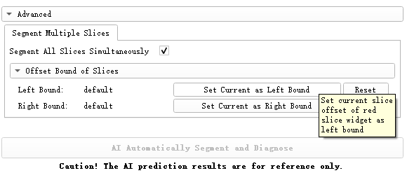

# Breast Ultrasound Analysis Extension for 3D Slicer

## Introduction and Acknowledgements

Authors: Xiaojun Chen, Yi Zhang (Shanghai Jiao Tong University)

Contact: Prof. Xiaojun Chen (Shanghai Jiao Tong University)

Website: [https://github.com/ZhyBrian/SlicerBreastUltrasoundAnalysis](https://github.com/ZhyBrian/SlicerBreastUltrasoundAnalysis)

License: [Apache 2.0](https://www.apache.org/licenses/LICENSE-2.0)


## Module: Breast Ultrasound Analysis


This module is designed to help physicians diagnose intramammary lesions based on breast ultrasound images with nodules. Based on the DICOM ultrasound image imported into 3D Slicer, this module can segment the nodule from the image and predict whether the nodule is malignant through its built-in AI algorithm.

**Caution! The AI prediction results are not absolutely accurate, and are only for physicians' reference in diagnosis.**


### Troubleshooting

1. To enable this module, [PyTorch](https://pytorch.org/) must be installed in your 3D Slicer. **This module will install them automatically when you restart 3D Slicer for the first time after installing this module (so please be patient at that time). If the automatic installation fails,** check that your network connection is available and try entering the following code in Python Interactor (or Python Console): 

   ```python
   slicer.util.pip_install('torch torchvision torchaudio')
   ```

   or (especially for users located in China):

   ```python
   slicer.util.pip_install('torch torchvision torchaudio -i https://pypi.tuna.tsinghua.edu.cn/simple')
   ```

   Please restart 3D Slicer after installation to enable this module.

2. **If you encounter any issues when downloading the sample data automatically by clicking the `Download and Show Sample Data` button**, you may try downloading the sample data manually by using any of the following download links:

   - [SampleData (Google Drive)](https://drive.google.com/file/d/1ILKMUFD4wtgeFgvpiKPt5k0SQWVaJ2jG/view?usp=sharing)
   - [SampleData (Zoho WorkDrive)](https://workdrive.zoho.com.cn/file/jy075c6237954580e4ccf98fca3fd55bacf66)
   
   Import the downloaded sample data (`BenignSample.nrrd`) to 3D Slicer by `File`->`Add Data`.
   
3. **If you have any trouble downloading the net weight file automatically when you first click the `AI Automatically Segment and Diagnose` button**, you can try downloading the net weight file manually by using any of the following download links: 

   - [NetWeight (Google Drive)](https://drive.google.com/file/d/1lfYU8dPFIRQ4uWio_YlbG-31i35uttwA/view?usp=sharing)
   - [NetWeight (Zoho WorkDrive)](https://workdrive.zoho.com.cn/file/jy075dd560e5a2fe7475b8a02ebc889aca769)
   
   After downloading the net weight file (`net_weight_base.pth`), you need to move it manually to the correct path on your computer. First, locate the path of the `BUS_Diagnosis.py` file on your computer. The path to the `BUS_Diagnosis.py` file is usually something like this: `...\BreastUltrasoundAnalysis\lib\Slicer-x.x\qt-scripted-modules`. Then, move the downloaded `net_weight.pth` file to the `...\BreastUltrasoundAnalysis\lib\Slicer-x.x\qt-scripted-modules\Resources` directory. Once the net weight file is in the correct location, you should be able to run the `AI Automatically Segment and Diagnose` function without any issues.
   
   

### Screenshot


### Tutorial

#### Video Version

- [3D Slicer BreastUltrasoundAnalysis Extension Tutorial - YouTube](https://www.youtube.com/watch?v=-8aWt-vl0N0)

#### Text Version

1. Import breast ultrasound images in DICOM format (PNG format is available but not recommended) into 3D Slicer through `Add DICOM Data` module. (Sample Data can be downloaded and loaded by clicking `Download and Show Sample Data` button. Other download links: see in [Troubleshooting](#Troubleshooting) above)

2. Jump to `Breast Ultrasound Analysis` module and select the ultrasound volume you just imported as the input of the AI prediction algorithm in this module.

3. Select the output volume and output mask as the results of AI segmentation (`Create new Volume` and `Create new Segmentation` is highly recommended).

   

4. Drag the slider in the red slice widget to select a slice which is suitable for diagnosis.

5. Click `AI Automatically Segment and Diagnose` button and wait for several seconds.

6. The results of AI segmentation will be automatically presented in the scene. The `Diagnosis Information` on the left records the patient's name, the ID of the input and output Nodes, the offset of the slice you selected, and the prediction result of AI algorithm  (whether the nodule is benign or malignant and its probability).

7. You can revise the segmentation mask predicted by AI in `Segment Editor` Module. After that, you can save all the diagnosis results by clicking `Save Diagnosis Results` button. The saved results include more detailed diagnostic information, the input 2D ultrasound image and the original & revised segmentation mask.

   

- If you checked `Segment All Slice Simultaneously` before clicking `AI Automatically Segment and Diagnose` button, the AI algorithm will segment all slices (by default) in the red slice widget at the same time. You can also set the left and right offset bounds to segment a specific portion of the input ultrasound volume. Note that this process may take several minutes to compute, and the function of classifying breast nodules and saving diagnosis results is unavailable in this mode.

  
